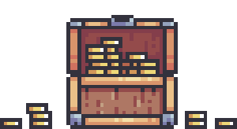

    

<h1 align="center">Aye bucko!</h1>

<h3 align="center">
  <a href="CONTRIBUTING.md">Contribute</a>
   · 
  <a href="https://github.com/jog1t/aye-bucko/projects/1">Current status</a>
</h3>

Simple and fun 2D platformer, where you and your friends go through various maps while picking up all pirate goodies, jumping through traps and obstacles and building your path to most precious priate award - the treasure chest.

### Technologies / libraries used

- Node.js
- Phaser
- Webpack
- [Colyseus](https://www.colyseus.io/)
- [Geckos.io](https://geckosio.github.io/)

### Structure

- `ambrose-light` - shared utilities
- `black-pearl` - main frontend app
- `whydah` - multiplayer server
- `fair-wind` - compiled / packed assets
- `hai-peng` - source assets

### Contributing

More information about how to contribute can be found [here](https://github.com/jog1t/aye-bucko/blob/master/CONTRIBUTING.md). All suggestions, ideas and bug reports are highly appreciated.

---
<small>Any questions or suggestions? Head over to the [discussions tab](https://github.com/jog1t/aye-bucko/discussions)! </small>
